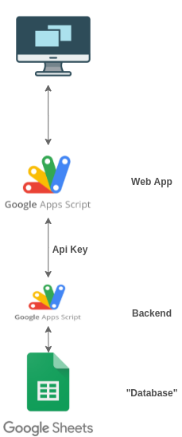
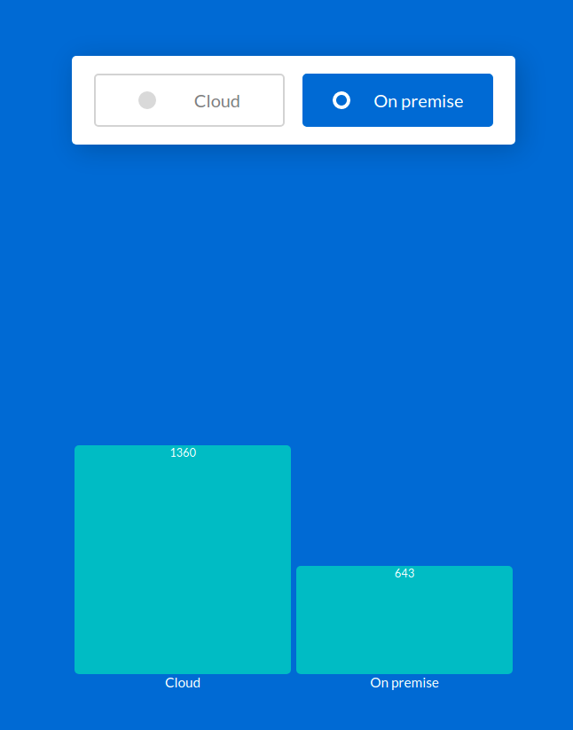

# Serverless voting app

Example of a serverless voting app powered by Google Apps Script for teaching purposes @ [UAB](https://uab.cat).

# Architecture

# Components

1. [**Frontend webapp**](Frontend): Google Apps script that serves HTML/CSS/Javascript to the user and some [server code](Frontend/Code.gs.js) to communicate with Backend

1. **Backend**
    * [**Google Apps Script**](Backend/Server.gs.js) that manages votes and calculated information
    * **Google Spreadsheet** to store information

Frontend and Backend share an Api Key to authenticate requests.

# Screen

